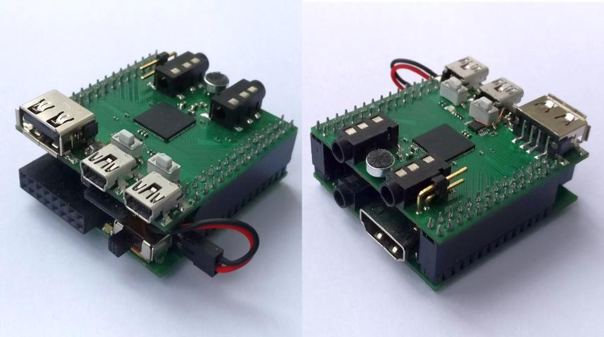
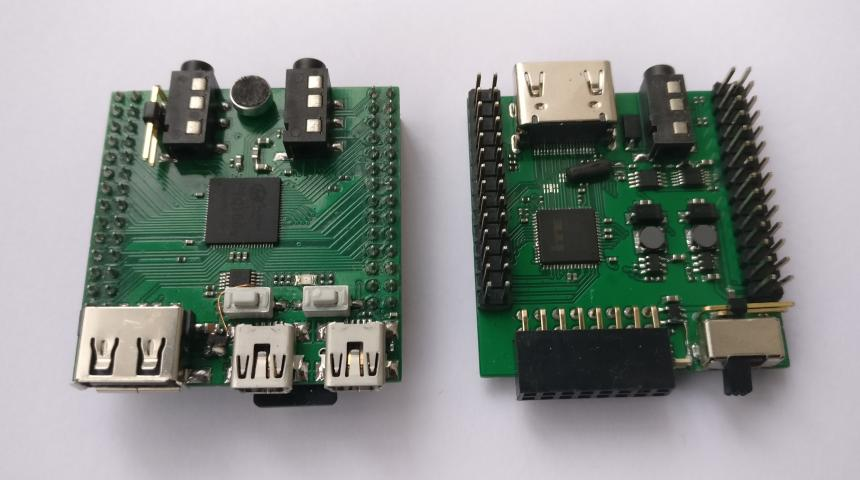
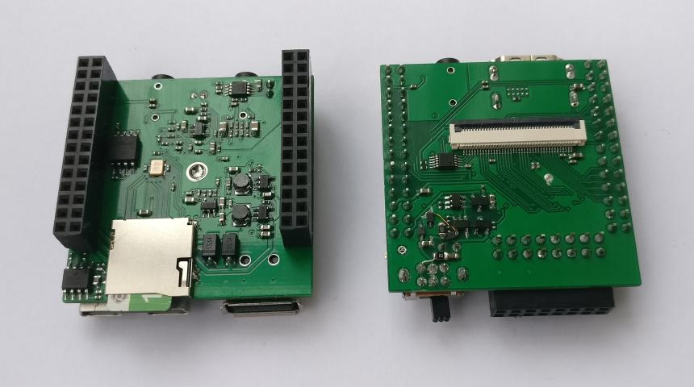

# F1C100S (F1C200S) Dual Board Computer

The project is based on Allwinner's F1C100S processor (ARM9). The device includes two boards. In the minimal use case, only the top board is sufficient. The [f1c_nonos](https://github.com/minilogic/f1c_nonos) project contains examples of baremetal programs for this device.

[Top board](./sch/f1c_top_board.pdf) features:
- F1C100S or F1C200S CPU;
- µSD-card socket;
- USB Host/Device;
- USB-UART bridge;
- embedded microphone;
- mono-audio amplifier;
- stereo-audio output;
- TV and mono-audio output.

[Bottom board](./sch/f1c_bot_board.pdf) features:
- power control from Li-Ion battery;
- real time clock;
- FM-radio;
- TV input;
- 40-pin TFT socket and touch screen controller;
- HDMI output. 

